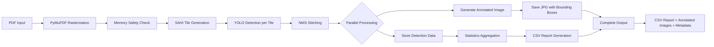

# Architectural Construction Documentation

[](https://www.python.org/downloads/)

A computer vision pipeline for detecting architectural elements (doors, windows, walls, objects) in floor plan PDFs using YOLO and MMDetection frameworks with SAHI slicing for large-format drawings.

## Project Overview

This project implements a modular computer vision pipeline for object detection in architectural drawings. It supports both YOLO (Ultralytics) and MMDetection frameworks, using SAHI (Slicing Aided Hyper Inference) to handle large A0/A1 format drawings without losing detail due to image size limitations.

### Key Features
- **Multi-Framework Support**: Choose between YOLO (fast, simple) and MMDetection (higher accuracy, complex scenes)
- **SAHI Slicing**: Processes large architectural drawings by dividing them into overlapping tiles, enabling detection on high-resolution scans without downscaling
- **Unified Detection Workflow**: Single command produces both quantitative CSV statistics and visual annotated images with bounding boxes
- **Model Training**: Train custom models on architectural datasets with checkpoint resume for interrupted training
- **Memory-Safe Processing**: Optimized for 6GB GPUs with automatic downscaling for very large images
- **Debug Mode**: SAHI tile visualization for parameter tuning and troubleshooting split objects
- **Comprehensive Reporting**: CSV statistics, annotated images, and JSON metadata for complete documentation
- **Auto-Framework Detection**: Automatically detects which framework to use based on model file extension
- **Flexible Model Selection**: Choose from nano to xlarge YOLO variants optimizing speed/accuracy tradeoff

### Supported Element Classes
- `door` - Door elements in floor plans
- `window` - Window elements
- `wall` - Wall segments
- `object` - Miscellaneous architectural objects

### Success Criteria
- >90% precision on vector-based PDF floor plans
- Accurate element counting with minimal false positives
- Handles A0/A1 drawings at 300 DPI without quality loss

## Installation

### Prerequisites
- Windows OS
- Conda installed (recommended for environment management)
- NVIDIA GPU with 6GB+ memory (GTX 1660Ti or better) recommended, CPU supported

### Installation Steps

1. **Create Conda Environment**:
   ```bash
   conda create -n your-environment python=3.12
   ```

2. **Activate Environment**:
   ```bash
   conda activate your-environment
   ```

3. **Install Standard Dependencies**:
   ```bash
   pip install -r requirements.txt
   ```

4. **Install GPU PyTorch** (Windows CUDA 11.8):
   ```bash
   pip install torch torchvision --index-url https://download.pytorch.org/whl/cu118
   ```

5. **Verify Installation**:
   ```bash
   python -c "import torch; print(torch.cuda.is_available())"
   python -c "import ultralytics; import sahi; import fitz"
   ```

### Troubleshooting Installation
- **CUDA not detected**: Update GPU drivers, verify CUDA version compatibility, reinstall PyTorch with correct CUDA index URL
- **Import errors**: Ensure conda environment is activated, check Python path, reinstall dependencies
- **PyTorch installation fails**: Use CPU-only version if GPU setup issues: `pip install torch torchvision`

## Quickstart

### Training Examples

**YOLO Training (Default):**
```bash
python main.py train --data data/floortest3.1.v1-data.yolov8/data.yaml --epochs 50 --batch-size 16
```

**MMDetection Training:**
```bash
python main.py train --framework mmdetection \
    --mmdet-config configs/mmdet/_base_/models/cascade_rcnn_r50_fpn.py \
    --data data/architectural_coco/ \
    --epochs 12
```

### Detection Examples

**Auto-Framework Detection (Recommended):**
```bash
python main.py detect --input floor_plan.pdf --output results/
# Framework automatically detected from model file (.pt = YOLO, .pth = MMDetection)
```

**Explicit Framework Selection:**
```bash
# Force YOLO detection
python main.py detect --framework yolo --input floor_plan.pdf --output results/

# Force MMDetection detection
python main.py detect --framework mmdetection --input floor_plan.pdf \
    --mmdet-config configs/mmdet/_base_/models/cascade_rcnn_r50_fpn.py \
    --output results/
```

### Debug Mode Example
Enable SAHI tile visualization for parameter tuning:
```bash
python main.py detect --input plan.pdf --output results/ --debug
```

### Architecture Selection (Phase 7)

List available YOLO model architectures:
```bash
python main.py train --help
```

Train with YOLOv11 small variant:
```bash
python main.py train --data data/floortest3.1.v1-data.yolov8/data.yaml \
                     --architecture yolo11 \
                     --variant small \
                     --epochs 50
```

Train with config.yaml architecture settings:
```bash
# Edit config.yaml:
# training:
#   model_architecture: 'yolo11'
#   model_variant: 'medium'

python main.py train --data data.yaml --epochs 50
```

Detection automatically uses trained model architecture:
```bash
python main.py detect --input floor_plan.pdf --output results/
# Architecture detected from model weights automatically
```

### Checkpoint Management

**Finding Your Checkpoint:**
After training, checkpoints are saved in `runs/train/trainN/weights/`:
- `last.pt` - Latest epoch (use this to resume)
- `best.pt` - Best performing epoch (use this for inference)

**List Available Checkpoints:**
```bash
# Windows
dir /b runs\train\*\weights\last.pt

# Linux/Mac
ls runs/train/*/weights/last.pt
```

**Resume from Specific Checkpoint:**
```bash
# Resume training - preserves optimizer state (Adam parameters, learning rate, etc.)
python main.py train --resume runs/train/train6/weights/last.pt --data data/floortest3.1.v1-data.yolov8/data.yaml
```

**Best Practices:**
- ✅ Resume preserves **all optimizer state** (Adam momentum, learning rate, epoch counter)
- ✅ Only specify `--resume` and `--data` when resuming
- ❌ Don't specify `--epochs`, `--batch-size`, `--architecture`, or `--variant` (loaded from checkpoint)
- ✅ The best model is automatically copied to `models/custom_model.pt` after training completes
- 📖 See [`docs/RESUME_TRAINING_FIX.md`](docs/RESUME_TRAINING_FIX.md) for detailed resume training guide

**Configuration Note:**
- `model_path` in `config.yaml` is **only required for detection mode**, not for training
- Training uses pretrained weights via `model_architecture` and `model_variant` settings
- You can create a training-only config without specifying `model_path` (see `config/config_training_only.yaml`)

### Expected Outputs (Detect Mode)
- **CSV Report**: `results/detection_report.csv`
  - Columns: Page_ID, Class, Count, Confidence_Avg, Min_Confidence, Max_Confidence
- **Annotated Images**: `results/page_N_detections.jpg`
  - Visual verification with bounding boxes, class labels, and confidence scores
- **Metadata**: `results/run_metadata.json`
  - Run documentation with timestamp, config, and detection summary
- **Debug Files** (if --debug enabled):
  - `results/debug/page_N_stitched.jpg`: Full-page detection coverage
  - `results/debug/page_N_tiles.jpg`: Tile boundaries
  - `results/tiles/tile_*.jpg`: Individual tile detections

## Configuration Guide

The pipeline uses `config/config.yaml` for centralized configuration. Key sections and parameters:

### Config Sections
- **system**: GPU device settings, logging configuration
- **model**: Model weights path (required for inference only), confidence threshold
- **inference**: DPI settings, SAHI parameters
- **training**: Architecture selection, hyperparameters, augmentation settings

**Note:** For training-only workflows, you can omit `model_path` from the config (see `config/config_training_only.yaml` example). Training uses pretrained weights specified by `model_architecture` and `model_variant`.

### Critical Parameters

| Parameter | Default | Description | Tuning Guidance |
|-----------|---------|-------------|-----------------|
| `model_path` | `models/custom_model.pt` | Path to trained model | **Required for inference/detection only**. Omit for training mode. |
| `model_architecture` | `yolov8` | YOLO architecture variant | Choose: `yolov8`, `yolo11`. Used for training only. |
| `model_variant` | `nano` | Model size variant | Choose: `nano`, `small`, `medium`, `large`, `xlarge`. Speed vs accuracy tradeoff. |
| `dpi` | 300 | Rasterization quality | Increase to 400 for detailed drawings, decrease to 200 for speed |
| `slice_height/width` | 640 | SAHI tile dimensions | Match YOLO input size, don't change unless model changed |
| `overlap_ratio` | 0.2 | Tile overlap percentage | Increase to 0.3 if seeing duplicates at boundaries |
| `confidence_threshold` | 0.5 | Detection confidence cutoff | Increase to 0.6-0.7 to reduce false positives |
| `max_megapixels` | 200 | Memory safety threshold | Provides margin for 6GB GPUs (A0@300DPI ≈130MP) |

### Directory Structure
```
project_root/
├── src/
│   ├── training/      # Model training infrastructure
│   ├── inference/     # Detection pipeline with SAHI
│   ├── reporting/     # CSV and visual output generation
│   └── utils/         # Shared utilities (config, validation)
├── config/
│   └── config.yaml    # Centralized configuration
├── models/
│   └── custom_model.pt # Trained model weights
├── data/
│   ├── floortest3.1.v1-data.yolov8/  # Training dataset
│   └── output/        # Detection results
├── tests/             # Test suites
├── docs/              # Additional documentation
├── main.py            # Application entry point
└── requirements.txt   # Python dependencies
```

## Troubleshooting

### Common Issues

**CUDA Not Detected**
- Verify GPU drivers are installed and up-to-date
- Check PyTorch installation: `python -c "import torch; print(torch.version.cuda)"`
- Ensure CUDA-enabled PyTorch (not CPU-only) was installed

**Out of Memory Errors**
- Training: Reduce `batch_size` in config.yaml (try 8 or 4)
- Inference: Reduce `dpi` (try 200), system auto-downscales based on `max_megapixels`

**Corrupt PDF Errors**
- Check `processing.log` for specific page numbers
- PDFs may have mixed raster/vector content or encryption
- Try processing individual pages or converting PDF format

**Low Detection Accuracy**
- Tune `confidence_threshold` in config.yaml
- Retrain with more data or adjusted augmentation
- Use debug mode to identify split objects at tile boundaries

**Import Errors**
- Verify all dependencies: `pip list | grep -E "(torch|ultralytics|sahi|PyMuPDF)"`
- Ensure conda environment activated
- Check requirements.txt versions compatibility

### Advanced Documentation
For SAHI parameter optimization, see `docs/TUNING_GUIDE.md`
- **🌟 No-Editing Config Guide** (`docs/NO_EDITING_CONFIG.md`): **One config for both modes - NO editing/uncommenting needed!** ⭐ Must-read!
- **Unified Config Guide** (`docs/UNIFIED_CONFIG.md`): Detailed guide on using same config.yaml for training AND detection
- **Multi-Architecture Guide** (`docs/MULTI_ARCHITECTURE_GUIDE.md`): Architecture selection, configuration methods, workflow examples, troubleshooting
- **Model Organization** (`docs/MODEL_ORGANIZATION.md`): How models are organized, why pretrained models stay in models/ directory, cleanup guidelines
- **Model Path Configuration** (`docs/MODEL_PATH_CONFIG.md`): When model_path is required (inference only) vs optional (training), config examples
- **Logging Fix** (`docs/LOGGING_FIX.md`): Solution to triple logging output issue, idempotent setup_logging() implementation

### Pipeline Visualization


